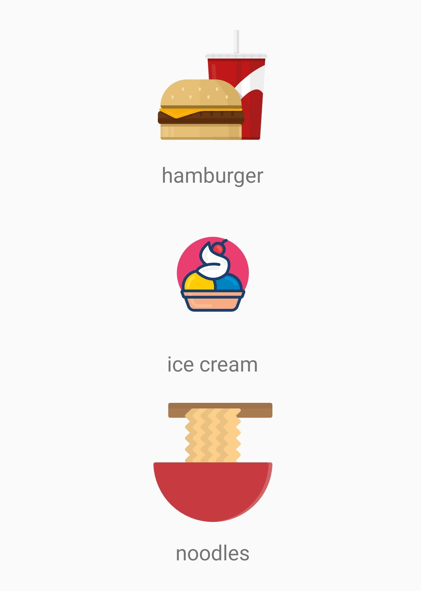
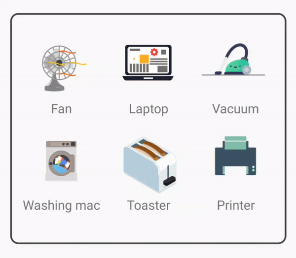
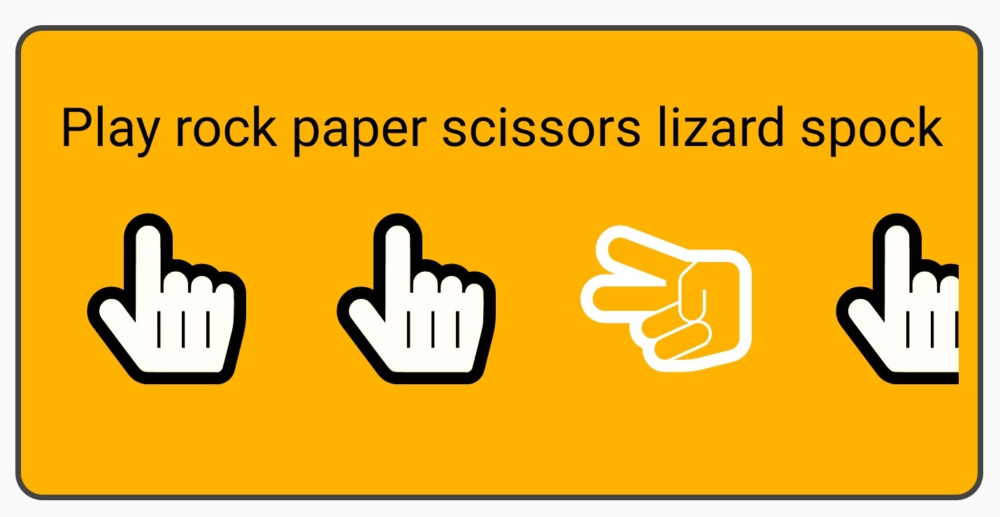

# ClickableIcons

ClickableIcons is a library for Android, that helps creating a set of clickable icons with various types.

## Getting Started

Place the following inside 'build.gradle' (project):
```
dependencies {
        ...
        classpath 'com.jfrog.bintray.gradle:gradle-bintray-plugin:1.8.4'
        classpath 'com.github.dcendents:android-maven-gradle-plugin:2.1'
    }
    
allprojects {
    repositories {
        google()
        jcenter()
        maven { url 'https://dl.bintray.com/geekybeansapps/maven-repo' }
    }
}
```

And the following inside 'build.gradle' (app):
```
dependencies {
    ...
    implementation 'com.geekybeans.clickableiconslib:clickableiconslib:1.1.0'
    ...
}
```
The latest version is: `1.1.1`


Lets review the different icon types:
##### Image icon:



`ImageIcon(R.drawable.drawable_id, "icon_description", true, true)`

* The first argument is the drawable resource id.<br/>
* The second argument is the icon’s description.<br/>
* The third argument is for showing the icon’s description text below it.<br/>
* This argument is optional, and if no value is passed it’s default value will be false.<br/>
* The fourth argument is for making the icon fade out on pressed.<br/>
  This argument is optional, and if no value is passed it’s default value will be false.<br/>

##### Animated icon:



`LottieAnimatedIcon(R.raw.animation_id, "icon_description", true, true, SPEED_VAL, COUNT_VAL)`

* The first argument is the animation resource id - a json animation.<br/>
* The second argument is the icon’s description.<br/>
* The third argument is for showing the icon’s description text below it.<br/>
  This argument is optional, and if no value is passed it’s default value will be false.<br/>
* The fourth argument is for making the icon fade out on pressed.<br/>
  This argument is optional, and if no value is passed it’s default value will be false.<br/>
* The fifth argument is a float value representing the animation’s speed.<br/>
  This argument is optional, and if no value is passed it’s default value will be 1f (which is the normal speed).<br/>
* The sixth argument is an int representing the animation’s repeatition count.<br/>
  This argument is optional, and if no value is passed it’s default value will be infinite looping.<br/>

##### Selectable icon:



**Option 1 - create from existing selector**
`SelectableIcon(getDrawable(R.drawable.selector_item_spock), "lizard", false)`

* The first argument is the selector drawable resource id.<br/>
  Make sure the selector uses the selected/deselected states.<br/>
* The second argument is the icon’s description.<br/>
* The third argument is for showing the icon’s description text below it.<br/>
  This argument is optional, and if no value is passed it’s default value will be false.<br/>


**Option 2 - pass two drawables and let the library create a selector programmatically** 
`SelectableIcon(this, R.drawable.ic_fist, R.drawable.ic_hand_peace, "peace", false)`

* The first argument in the view’s context.<br/>
* The second argument is the deselected drawable resource id.<br/>
* The third argument is the selected drawable resource id.<br/>
* The fourth argument is the icon’s description.<br/>
* The fifth argument is for showing the icon’s description text below it.<br/>
  This argument is optional, and if no value is passed it’s default value will be false.<br/>

This constructor takes the drawable resources and creates a selector automatically.


##### Creating the Icon set view:
In order to use the clickable icon set, just use it in the layout file (with or without its additional attributes):
```
<com.geekybeans.clickableiconslibrary.models.ClickableIconSet
        android:id="@+id/view_iconset"
        android:layout_width="wrap_content"
        android:layout_height="wrap_content"
        app:show_title="true"
        app:show_frame ="false"/>
```
show_title (Boolean) → shows the view’s given title.<br/> 
title (String) → sets the view’s title.<br/>
title_text_size (Float) → sets the title’s text size.<br/>
title_text_color (Color) → sets the title’s color.<br/>
show_frame (Boolean) → shows a frame around the view.<br/>
frame_color (Color) → sets the frame’s stroke color.<br/>
fill_color (Color) → set the view’s background color.<br/>

Set the icon set view attributes programmatically:<br/>
setTitle → sets the title’s params (show/hide, color…)<br/>
setFrame → set the frame’s params (show/hide, color…)<br/>
setBackground → sets the view's background color.<br/>


#### Creating the view’s adapter:

Set the clickable icon set adapter with optional attributes:
```
ClickableIconAdapter.Builder()
            .iconSetView(view_iconset) //the view’s object
            .iconSet(IconList) //list of ClickableIcon objects
            .setLayoutManager(layoutManager)
            .setOrientation(orientation)
            .setAdapter(this, this)
            .build()
```

iconSetView → sets the view’s object.<br/>
iconSet → sets the view’s icon list (ClickableIcon list).<br/>
setOrientation → sets the ClickableIconSet orientation (default is ORIENTATION_VERTICAL).<br/>
setLayoutManager → sets the ClickableIconSet layout manager (default is LAYOUT_LINEAR).<br/>
setLayoutSpanCount → sets the ClickableIconSet layout's span count (default is DEFAULT_SPAN_COUNT(3)), for the grid layout.<br/>
setIconSize → sets the icon's width and height (default is WRAP_CONTENT).<br/>
setAdapter → Set the adapter for the ClickableIcon set.<br/>
build → builds the ClickableIconSet view according to the builder's values.<br/>

